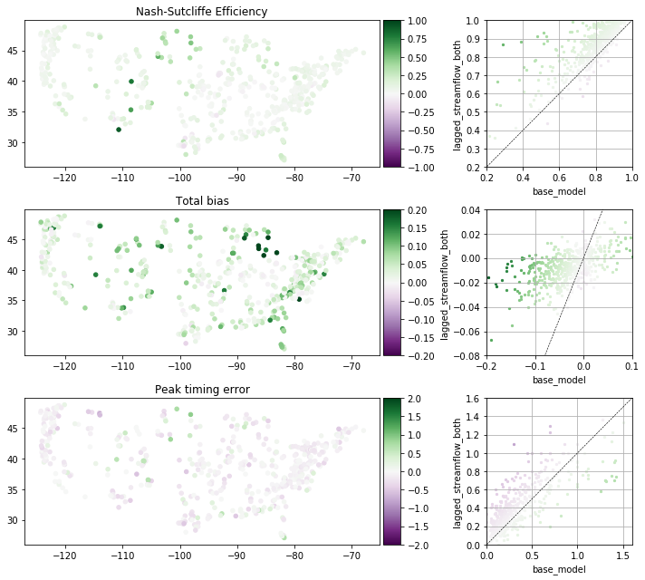

# Analyzing results from Data Assililation with LSTM

### Main analysis done with Jupyter Notebook:
- assimilation_analysis.ipynb
- assimilation_analysis_jmframe.ipynb

#### There should be four pickle files with results here:
- data/ensemble_metrics.pkl
- data/individual_run_metrics.pkl
- data/observations.pkl
- data/simulations.pkl

#### There also should be some specific files for the analysis:
- camels_attributes_v2.0/ 
- usgs_site_info.csv  
