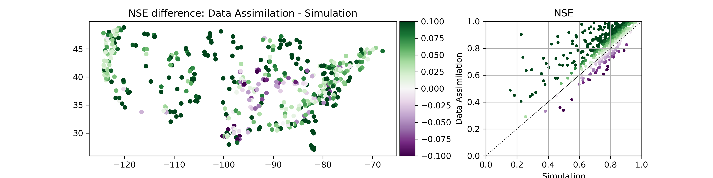

# Analyzing results from Data Assililation with LSTM

### Main analysis done with Jupyter Notebook:
- assimilation_analysis_jmframe.ipynb

## ./data/
#### To run the notebook there should be three pickle files with results here:
- simulation/.../test_results.p
- data_assimilation/.../test_results.p
- autoregression/.../test_results.p
#### There also should be some specific files for the analysis:
- camels_attributes_v2.0/ 
- usgs_site_info.csv  

## ./tools/
- analysis_tools.py Has a bunch of functions used in the "assimilation_analysis_jframe.ipynb" workbook
- corrstats.py Functions for calculating the statistical significant differences between two dependent or independent correlation coefficients 
- metrics.py Metrics taken from NeuralHydrology code
- signatures.py Hydrologic signature calculations taken from NeuralHydrology code
